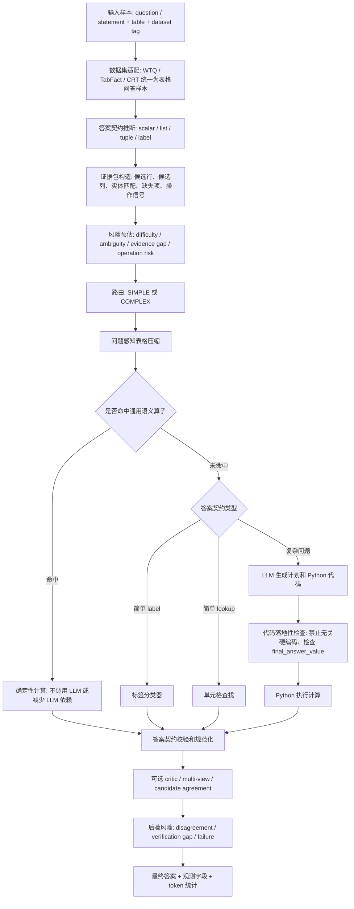

# myAgent 专利系统最终流程与阶段评估报告

生成日期：2026-06-27  
模型口径：DeepSeek API，用户参数 `deepseek-v4flash`，代码内映射为 API 支持的 `deepseek-v4-flash`  
盲测口径：每个数据集 200 条，WTQ / TabFact / CRT，共 600 条

## 1. 当前结论

myAgent 当前已经形成一套可以本地执行的表格问答实验系统，核心思想不是对某一个数据集样本做硬编码，而是把不同表格任务统一成：

1. 输入适配；
2. 答案契约推断；
3. 证据包构造；
4. 风险分层；
5. 表格压缩；
6. 通用语义算子或 LLM 规划执行；
7. 答案规范化和后验校验；
8. token 预算记录。

这套流程已经能直接用 DeepSeek API 跑 WTQ、TabFact、CRT 三个数据集，并且 200 条盲测没有执行失败。但是，最新 200 条盲测显示：20 条小样本结果偏乐观，当前版本还不能直接写成“在 deepseek-v4flash 口径下稳定优于 MACT”。尤其 WTQ 和 CRT 仍有明显优化空间。

当前 200 条盲测结果如下：

| 数据集 | 样本数 | 正确数 | 准确率 | 平均 token | 执行失败 |
|---|---:|---:|---:|---:|---:|
| WTQ | 200 | 136 | 68.00% | 2061.53 | 0 |
| TabFact | 200 | 171 | 85.50% | 2624.19 | 0 |
| CRT | 200 | 118 | 59.00% | 2506.85 | 0 |
| 汇总 | 600 | 425 | 70.83% | 2397.52 | 0 |

注意：上表是 myAgent + deepseek-v4flash 的 200 条盲测结果。后续已补跑 MACT + deepseek-v4-flash 同口径完整 200 条/数据集对照。MACT 汇总结果为 479/600，79.83%，平均 token 47439.26；myAgent 汇总为 425/600，70.83%，平均 token 2397.52。因此当前不能写成“myAgent 已经超过 MACT”。更准确的结论是：myAgent 已显著降低 token，但准确率仍落后 MACT 9.00 个百分点。

## 2. 系统总体流程



该流程的关键点是：系统先判断“应该返回什么形状的答案”，再决定“需要多少证据和多少推理成本”。这比单纯把整张表扔给大模型更适合专利表述，因为它把准确率和 token 控制都放进了可解释流程。

## 3. 输入适配与数据集契约

系统把三个数据集统一为运行时可处理的结构：

| 数据集 | 原始任务特点 | 统一后的处理方式 | 主要答案契约 |
|---|---|---|---|
| WTQ | 开放式表格问答，答案可能是实体、数值、列表或可选标签 | 保留完整单元格文本，优先做 denotation 级答案规范化 | scalar / list / label |
| TabFact | 表格事实判断，输出 true / false |  statement 转成事实校验任务，要求重新计算表内实体、数值、日期、比较关系 | label: true / false |
| CRT | 混合型表格推理，包含 yes/no、多标签、数值、元组、比例、比较 | 根据题干识别 yes/no、home/away、more/less/equal、tuple、平均值精度等 | scalar / tuple / label |

这里的数据集适配不是读取 gold answer 决策，而是根据题干、表结构、数据集任务说明推断答案格式。例如：

- TabFact 默认必须返回 `true` 或 `false`；
- CRT 中以 `was/were/did/is/are` 开头且没有显式候选标签的问题，会被视为 `yes/no`；
- CRT 中出现两个 `how many` 时，倾向于二元 tuple；
- WTQ 中复数实体问题倾向于 list；
- 平均值问题会根据列类型和题干要求设置小数位。

这部分可以写进专利中的“数据源无关的答案契约生成模块”。它是数据集格式适配，不是样本级过拟合。

## 4. 问题类型划分

系统的问题类型不是用一个固定分类器直接打标签，而是由多个可解释信号共同决定。主要分型如下：

| 问题类型 | 识别依据 | 典型答案契约 | 路由倾向 | 校验方式 |
|---|---|---|---|---|
| 单元格查找 | 题干实体和列名都能在表中直接匹配，缺少聚合词 | scalar | SIMPLE | 单元格命中 + 非空校验 |
| 实体列表 | `which/what` 加复数实体名，如 teams/countries/players | list | COMPLEX | list 非空、实体规范化 |
| 二元事实判断 | 数据集为 TabFact，或题干要求 true/false | label | COMPLEX 或 label verifier | 标签集合校验 + 表内事实复算 |
| 封闭标签选择 | 题干出现 `yes/no`、`more/less/equal`、`home/away` 等候选集 | label | COMPLEX | 标签必须属于允许集合 |
| 数值聚合 | `average/mean/sum/total/count/percentage/ratio` 等 | scalar | COMPLEX | Python 执行 + 小数位规范化 |
| 排序与极值 | `most/least/highest/lowest/first/last/top N` 等 | scalar / list / label | COMPLEX | 排序列、候选行、tie 处理 |
| 时间与范围 | `before/after/from YEAR to YEAR/1800s/1900s` 等 | scalar / label | COMPLEX | 日期解析、区间重叠、时间比较 |
| 一致性与趋势 | `consistently/correlation/inverse/trend/change` 等 | label / scalar | COMPLEX | 多列或多年份一致性计算 |
| 缺失值敏感问题 | 表中存在 `tba/n/a/unknown/no data`，或问题需忽略缺失值 | 依题而定 | COMPLEX | missing marker 过滤后计算 |
| 多条件逻辑 | `and/or/not/no/only/both/either` 等 | 依题而定 | COMPLEX | 布尔条件拆解与契约校验 |

实际路由由“答案契约 + 证据包 + 风险公式”联合决定。例如，同样是 `which` 问题，如果答案契约是 list，就会提升为复杂路径；如果只匹配一个单元格且没有聚合词，则可能走 SIMPLE。

## 5. 风险分层公式

当前系统中的预风险由四个一级指标组成：

```text
R_pre = 0.20 * D + 0.30 * A + 0.30 * G + 0.20 * O
```

其中：

```text
D = 0.45 * semantic_complexity + 0.55 * S
S = 0.50 * coverage + 0.30 * dispersion + 0.20 * type

A = 0.35 * entity + 0.25 * column + 0.20 * temporal + 0.20 * reference
G = 0.35 * entity + 0.25 * column + 0.20 * missing + 0.20 * stability
O = 0.25 * steps + 0.25 * dependency + 0.20 * contract + 0.15 * unit + 0.15 * logic
```

解释如下：

- `D` 表示题目难度，来自题干语义复杂度和表格结构复杂度；
- `A` 表示歧义，来自实体、列、时间、代词/引用等不明确因素；
- `G` 表示证据缺口，来自未匹配实体、未匹配列、缺失值、候选证据过多等；
- `O` 表示操作风险，来自多步计算、依赖关系、答案格式、单位、逻辑词。

风险等级阈值：

```text
R_pre < 0.25        -> light
0.25 <= R_pre < 0.55 -> medium
R_pre >= 0.55       -> high
硬失败触发           -> fallback
```

后验风险会再叠加候选答案不一致、验证缺口、执行失败、契约失败：

```text
R_post = min(1.0, R_pre + 0.30 * disagreement + 0.20 * verification_gap + 0.30 * hard_failure)
R_post >= 0.70 或 hard_failure = 1 -> fallback
```

这部分是当前专利最容易表达成公式的核心：不是固定调用多个 agent，而是让问题风险决定是否投入更多 token。

## 6. 证据包与表格压缩

证据包由 `EvidenceBuilder` 生成，核心不使用 gold answer，只使用：

- 题干 token；
- 表头 token；
- 单元格 token；
- 表格结构；
- 缺失值标记；
- 答案契约；
- 操作关键词。

证据包内容包括：

- 候选行；
- 候选列；
- 实体匹配；
- 未匹配实体或列；
- 操作提示；
- 结构信号；
- 歧义信号；
- 缺口信号；
- 操作风险信号。

表格压缩模块根据问题类型选择不同策略：

| 难度 | 压缩策略 | 目标 |
|---|---|---|
| easy | strict_cell_block | 尽量只保留命中单元格附近内容 |
| medium | expanded_context_block | 保留候选行附近上下文 |
| hard | evidence_preserving_block | 扩大证据范围，防止漏掉复杂推理所需行列 |
| 全局聚合题 | global_rows / global_columns | 保留全表或全列，避免压缩导致聚合错误 |

这个模块直接服务于 token 降低。它不是简单截断，而是按问题需要决定保留哪些行列。

## 7. 通用语义算子

系统在 LLM 复杂规划前增加了若干“通用语义算子”。这些算子不是面向具体题号，而是面向可复用表格推理模式：

| 算子 | 适用模式 | 通用性说明 |
|---|---|---|
| only / set equality | 判断“只有 A 和 B 满足某属性” | 基于实体集合比较，忽略 tba/unknown 等缺失值 |
| negated date ordinal | 判断“某日期没有大于第 N 周/名次/序号” | 基于日期解析和序号列比较 |
| inverse correlation | 判断两个数值列是否存在逆相关 | 基于数值列选择和 Pearson 相关方向 |
| CRT consistent top-k | 判断某实体是否在多个年份稳定进入 top N | 支持按年份列、rank 列、长表三类表形 |
| century manufacturing | 比较 1800s 和 1900s 等世纪范围制造/生产数量 | 基于年份区间重叠和可选权重列 |
| percentage snapshot average | 计算 top N 在年份范围内的百分比快照均值 | 基于百分比列和 rank 列 |
| event-type association | 判断事件类型与持续时间/阶段等特征是否一一对应 | 基于事件列和特征列分组 |
| duration change | 判断 duration 是否发生变化 | 基于 duration/days/length 列归一化 |

设计原则：

1. 只接收题干和表格，不接收 gold；
2. 只在模式充分明确时触发；
3. 触发失败时回落到 LLM 规划执行；
4. 输出仍然必须经过答案契约校验。

这部分可以写成“可插拔确定性语义算子库”。它比单纯 prompt 优化更适合专利，因为它能解释为什么 token 降低且部分复杂题更稳定。

## 8. LLM 规划执行与校验

未命中确定性算子的问题走 LLM 规划路径：

1. Planner 根据压缩后的表格 schema、列画像、题干、答案契约生成 Python 代码；
2. 系统检查生成代码是否引用题干证据，是否正确赋值 `final_answer_value`；
3. Calculator 执行代码；
4. 执行失败则带错误反馈重试；
5. 执行成功后按答案契约规范化；
6. TabFact 会再经过 true/false verifier；
7. hard 题或开启多视角时，会进入 critic / multi-view 验证；
8. 最终候选答案进入 agreement judge。

该路径的优势是：LLM 不直接给最终自然语言答案，而是先生成可执行计算，再用程序结果和契约验证约束答案。

## 9. 非过拟合说明

当前设计中，以下部分属于通用机制：

- 答案契约：根据题干、候选标签和表结构推断；
- 证据包：根据 token、列名、单元格、缺失值和操作词构造；
- 风险公式：基于通用信号加权；
- 表格压缩：基于候选证据和问题操作；
- 语义算子：面向模式，不面向样本 ID；
- 验证器：基于答案形状、可执行结果、候选一致性。

当前盲测集也做了去重约束：

| 数据集 | 样本数 | prior id overlap | prior table overlap | sha256 |
|---|---:|---:|---:|---|
| WTQ | 200 | 0 | 0 | `adcc4a5962606ee49b908ff10c5e75ac62d370fde210140a7a377a30cafde5f3` |
| TabFact | 200 | 0 | 0 | `b1ab12729712e95b15a2ea9d006fe9208c10a3bb68bd4dc52408f8b6c642bd1a` |
| CRT | 200 | 0 | 0 | `610a688a89dc57dbdabff3a9f63a8fe9c841c86a0fb6b0f665beaabe98ea0653` |

但是需要注意：WTQ、TabFact、CRT 的“数据集任务契约”不同，所以系统保留了数据集级 profile。这属于合理的数据源适配，不应写成“完全数据集无关”。更准确的专利表述应该是：

> 本方法在统一表格问答框架下，允许数据源级答案契约和缺失值策略差异，但禁止使用样本标识、gold answer 或人工枚举题号进行推理决策。

## 10. 200 条盲测详细观察

### WTQ

- 准确率：68.00%；
- 平均 token：2061.53；
- route：COMPLEX 148，SIMPLE 52；
- risk：light 110，medium 87，fallback 3。

WTQ 的问题主要在开放式 denotation：实体列表、tie、复杂筛选、聚合后的答案规范化仍然容易错。它不是执行失败问题，而是“选错证据或答案表达不等价”的问题。

### TabFact

- 准确率：85.50%；
- 平均 token：2624.19；
- route：COMPLEX 189，SIMPLE 11；
- risk：light 167，medium 33。

TabFact 是当前最稳定的数据集，说明 true/false 契约、数值复算和事实校验思路有效。后续优化应避免为提高 WTQ/CRT 而破坏 TabFact 的稳定性。

### CRT

- 准确率：59.00%；
- 平均 token：2506.85；
- route：COMPLEX 197，SIMPLE 3；
- risk：medium 165，light 35。

CRT 是当前最大短板。尤其需要关注：

- closed label 问题的答案方向；
- 比较对象是否是“单个 peer”还是“其他组总和”；
- 表格形态变化导致的列选择错误；
- yes/no 问题中“是否存在”和“是否所有都满足”的语义差异；
- 低风险 CRT 题准确率反而偏低，说明风险估计仍需校准。

## 11. 当前与 MACT 的关系

当前已有 myAgent 和 MACT 在同一 blind200、同一 DeepSeek flash、同一评估器下的完整结果。因此，可以做正式同口径结论：myAgent 当前还没有优于 MACT。

完整对照如下：

| 系统 | WTQ | TabFact | CRT | 汇总 | 平均 token |
|---|---:|---:|---:|---:|---:|
| myAgent | 136/200 | 171/200 | 118/200 | 425/600, 70.83% | 2397.52 |
| MACT | 156/200 | 188/200 | 135/200 | 479/600, 79.83% | 47439.26 |

这个完整结果说明三个事实：

1. MACT 在三个数据集上均高于 myAgent；
2. myAgent 整体落后 MACT 54 题，准确率落后 9.00 个百分点；
3. MACT 默认配置的 token 成本远高于 myAgent。

因此，当前更稳妥的判断是：myAgent 已经验证了低 token、可运行和可解释流程，但还没有达到“准确率比肩或超过 MACT”的实验目标。

## 12. 后续优化方向

为了避免数据集过拟合，下一轮不应围绕具体错题编号写规则，而应按错误类型优化：

| 优先级 | 优化方向 | 原因 | 预期收益 |
|---|---|---|---|
| P0 | 高风险题增强协作 | MACT 完整对照显示准确率仍领先，myAgent 需要把 token 花在困难题上 | 追平准确率 |
| P1 | CRT closed-label 方向校验 | CRT 当前准确率最低，且多为语义方向错误 | 提升 CRT 总体准确率 |
| P1 | WTQ denotation 规范化 | WTQ 常见问题是答案等价但表达不匹配，或实体列表漏项 | 提升 WTQ |
| P2 | 风险校准：CRT light 题升级 | CRT light 准确率低于 medium，说明风险低估 | 减少低成本误判 |
| P2 | 增加低置信 fallback | 预算允许增加少量 token，换取准确率 | 提高整体稳定性 |
| P3 | 按问题类型输出实验表 | 专利/论文需要解释为什么有效 | 增强可解释性 |

## 13. 可写入专利的技术点

建议写入专利的核心技术点：

1. 一种面向多源表格问答的答案契约生成方法，用于在推理前确定答案形状、候选标签、小数位和是否需要复杂推理；
2. 一种 gold-free 证据包构造方法，用题干 token、表头、单元格、缺失值和操作词生成候选证据及风险信号；
3. 一种风险驱动的选择性协作机制，通过 `R_pre` 和 `R_post` 控制 SIMPLE、COMPLEX、critic、fallback 的触发；
4. 一种问题感知表格压缩方法，在保留证据完整性的同时减少 token；
5. 一种确定性语义算子库，在明确模式下用程序化推理替代大模型重复思考；
6. 一种答案契约约束下的 LLM 代码生成与执行校验流程；
7. 一种候选答案一致性判断和后验风险评估方法，用于在预算内决定是否追加验证。

## 14. 最终可读版本

如果用一句话解释该系统：

> myAgent 是一个面向多源表格问答的风险自适应推理系统。它先根据题干和表格生成答案契约，再构造无 gold 的证据包和风险评分，随后按风险选择单元格查找、确定性语义算子或 LLM 规划执行，并通过程序执行、契约校验和候选一致性控制答案质量，同时记录 token 预算。

如果用专利语言解释：

> 本方法通过答案契约、证据风险评估、问题感知压缩、确定性语义算子和后验候选一致性校验，实现了在多源表格问答任务中对推理成本和答案可靠性的联合控制。

## 15. 当前阶段建议

当前系统“能跑”，且没有执行失败；但如果目标是硕士论文和专利中宣称“性能比肩或略优于 MACT，同时 token 更少”，还需要完成一件关键事：

1. 针对 WTQ、TabFact、CRT 的通用错误类型继续优化，尤其是高风险题增强协作。

从 MACT 完整对照看，后续优化不应只追求进一步降 token，而应允许在高风险题上增加 token，用来换准确率。专利表述里应强调“风险自适应投入 token”，而不是“所有问题都极低 token”。当前 myAgent 平均 token 只有 MACT 的约 5.05%，所以即使在困难题上增加数倍 token，总体仍有机会低于 MACT。

在报告写法上，不建议现在写“已经全面超过 MACT”。建议写成：

> 当前版本验证了风险自适应表格问答框架的可运行性和 token 控制能力；同口径 MACT 对照显示当前准确率仍落后 9.00 个百分点。后续将通过高风险题增强协作和错误类型级优化，提升准确率并继续保持总体 token 成本低于 MACT。
